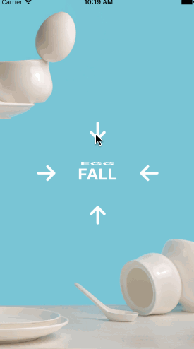

# STFakeLabel

STFakeLabel is not real 3D transform. 

**Objective-C** : A category of `UILabel` , named `UILabel+STFakeAnimtion.m`.

**Swift** : A extension of `UILabel` , named `STFakeAnimation.swift`.

Animate just need a single line of code.

## Screenshots



## Basic Examples

### Objective-C

``` objective-c
#import "UILabel+STFakeAnimation.h"

/*
  typedef NS_ENUM(NSInteger, STFakeAnimationDirection) {
    STFakeAnimationRight = 1,       ///< left to right
    STFakeAnimationLeft = -1,       ///< right to left
    STFakeAnimationDown = -2,       ///< up to down
    STFakeAnimationUp = 2           ///< down to up
  };
*/

[label st_startAnimationWithDirection:STFakeAnimationDown toText:@"newText"];
```

### Swift

``` swift
/*
  enum STFakeAnimationDirection: Int {
	case Right = 1       ///< left to right
	case Left = -1       ///< right to left
	case Down = -2       ///< up to down
	case Up = 2          ///< down to up
  }
*/

label.st_startAnimation(UILabel.STFakeAnimationDirection.Down, toText: "newText")
```

## MIT Lincense

``` 
The MIT License (MIT)

Copyright (c) 2015 saitjr

Permission is hereby granted, free of charge, to any person obtaining a copy

of this software and associated documentation files (the "Software"), to deal

in the Software without restriction, including without limitation the rights

to use, copy, modify, merge, publish, distribute, sublicense, and/or sell

copies of the Software, and to permit persons to whom the Software is

furnished to do so, subject to the following conditions:

The above copyright notice and this permission notice shall be included in all

copies or substantial portions of the Software.

THE SOFTWARE IS PROVIDED "AS IS", WITHOUT WARRANTY OF ANY KIND, EXPRESS OR

IMPLIED, INCLUDING BUT NOT LIMITED TO THE WARRANTIES OF MERCHANTABILITY,

FITNESS FOR A PARTICULAR PURPOSE AND NONINFRINGEMENT. IN NO EVENT SHALL THE

AUTHORS OR COPYRIGHT HOLDERS BE LIABLE FOR ANY CLAIM, DAMAGES OR OTHER

LIABILITY, WHETHER IN AN ACTION OF CONTRACT, TORT OR OTHERWISE, ARISING FROM,

OUT OF OR IN CONNECTION WITH THE SOFTWARE OR THE USE OR OTHER DEALINGS IN THE

SOFTWARE.
```